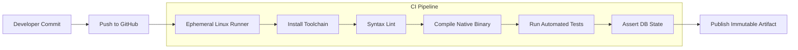

# Chapter 1: Introduction to COBOL CI/CD & DevOps

In the enterprise computing landscape, COBOL powers the core transactional backbones of banks, insurance underwriters, government treasuries, and logistics networks. Historically, updating and releasing COBOL applications was an infrequent, high-friction, and manual ordeal. 

In modern cloud, containerized, and microservice architectures, COBOL cannot remain isolated in a silo of manual operations. Modern engineering practices demand **Continuous Integration (CI)** and **Continuous Deployment (CD)** to ensure that every code change is automatically built, verified, tested, and packaged with zero human error.

---

## 1. The Historical Landscape: Mainframe Change Control vs. Modern GitOps

To appreciate the power of modern CI/CD, consider the traditional lifecycle of a mainframe COBOL change versus the modern GitOps workflow:

| Dimension | Traditional Mainframe Release Cycle | Modern Git & CI/CD Pipeline |
| :--- | :--- | :--- |
| **Source Control** | Proprietary PDS (Partitioned Data Sets), Endevor, Serena ChangeMan. File-locking models. | Distributed Git repositories (GitHub, GitLab), branch-based pull requests, concurrent feature development. |
| **Build Mechanism** | Manual execution of JCL compile decks (`//COMPILE EXEC PGM=IGYCRCTL`), relying on static partition libraries. | Automated build tools (`make`, `cmake`) running on ephemeral virtual machines or Docker containers. |
| **Testing** | Manual submission of test JCL batch jobs; visual inspection of spool outputs (`SDSF`); ad-hoc testing on shared test regions. | Automated unit, regression, and database integration tests executed on every single commit. |
| **Cycle Time** | Weeks or months per release cycle; extensive change advisory board (CAB) reviews; high-risk weekend deployments. | Minutes from commit to verified build artifact; continuous deployment to staging or production. |
| **Rollback & Audit** | Manual restoration of backup load modules; complex manual rollback procedures. | Git commit history, tagged immutable binary artifacts, automated rollback capabilities. |

---

## 2. What is Continuous Integration (CI)?

**Continuous Integration** is a software development practice where developers merge their code changes into a central repository frequently (often multiple times per day). Each merge triggers an automated build and test pipeline.

In a COBOL context, CI answers three critical questions within minutes of a commit:
1. **Does the code compile cleanly?** Does the COBOL code conform to syntax standards without warnings or errors?
2. **Does the native binary build and link?** Do external C libraries, copybooks, and database drivers link without missing symbol errors?
3. **Do all business rules and database transactions pass?** Did any change break arithmetic calculations, file handling routines, or database integrity?



---

## 3. Why COBOL Needs Modern CI/CD

Because enterprise COBOL systems manage critical financial calculations, ledger reconciliations, and mission-critical transactions, the cost of a defect escaping into production is astronomical. 

Modern CI/CD provides four essential pillars:

### A. Immediate Defect Detection (Shift-Left Testing)
In traditional setups, a bug introduced in a calculation subprogram might not be noticed until integration testing weeks later. In CI/CD, the moment a developer commits code with an erroneous arithmetic formula or misplaced `COMPUTE` statement, the automated regression suite fails immediately, notifying the developer within 90 seconds.

### B. Clean-Room Reproducibility
Mainframe and legacy Windows build environments frequently suffer from the *"it works on my machine/partition"* syndrome due to dirty local file systems, leftover test databases, or mismatched compiler versions. 

Modern CI engines run in **ephemeral runners**—clean, disposable virtual machines that start from a pristine operating system image, install tools from scratch, build the project, run tests, and are discarded. If the pipeline passes in CI, the build is guaranteed to be reproducible anywhere.

### C. Automated Database Integrity Checks
When COBOL applications interact with relational databases like SQLite or PostgreSQL, changes in table DDL or cursor queries must not corrupt schema constraints or drop transactional consistency. CI allows spinning up an isolated database, seeding records, running COBOL batch processes, and using database CLI tools to verify records with mathematical precision.

### D. Auditability and Regulatory Compliance
Financial institutions and healthcare organizations are subject to strict regulatory frameworks (SOX, PCI-DSS, HIPAA). GitHub Actions maintains an immutable, cryptographically verifiable history of every commit, who approved the pull request, the complete build logs, and the resulting cryptographic SHA-256 hash of the compiled artifact.

---

## 4. Pipeline Stages for a COBOL Application

A standard enterprise COBOL pipeline comprises the following sequential phases:

```text
+-------------------+      +-------------------+      +-------------------+
|  1. LINT / CHECK  | ---> |    2. COMPILE     | ---> |      3. TEST      |
| cobc -fsyntax-only|      | cobc -x -lsqlite3 |      | ./tests/test.sh   |
+-------------------+      +-------------------+      +-------------------+
                                                                |
                                                                v
+-------------------+      +-------------------+      +-------------------+
|    6. NOTIFY      | <--- |   5. ARTIFACT     | <--- |   4. ASSERT DB    |
| Slack / PR Status |      | actions/upload    |      | sqlite3 check     |
+-------------------+      +-------------------+      +-------------------+
```

1. **Lint / Syntax Check**: Verifies free/fixed format rules, variable definitions, and copybook references without generating machine code.
2. **Native Compile & Link**: Invokes `cobc` and `gcc` with required optimization and debug flags, linking shared libraries like `libsqlite3.so` and `libcob.so`.
3. **Execution & Regression Testing**: Executes the application against realistic test scenarios and verifies zero non-zero exit codes.
4. **Database Assertion**: Inspects database tables and rows directly using SQL queries to guarantee that committed transactions reflect expected state.
5. **Artifact Archiving**: Stores the compiled Linux binary as an immutable release artifact attached to the workflow run.
6. **Status Notification**: Updates the GitHub Pull Request badge to green (`Pass`) or red (`Fail`), blocking merge if any stage fails.

---

## 5. Summary & Next Steps

CI/CD transforms COBOL from a rigid, slow-moving legacy technology into an agile, modern component of enterprise cloud infrastructure.

In the next chapter, [02. GitHub Actions Fundamentals for COBOL](file:///home/wesi/codes/cobol-training/module_8/02_github_actions_fundamentals_for_cobol.md), we will explore the internal architecture of GitHub Actions and how to write workflow YAML files tailored for GnuCOBOL.

