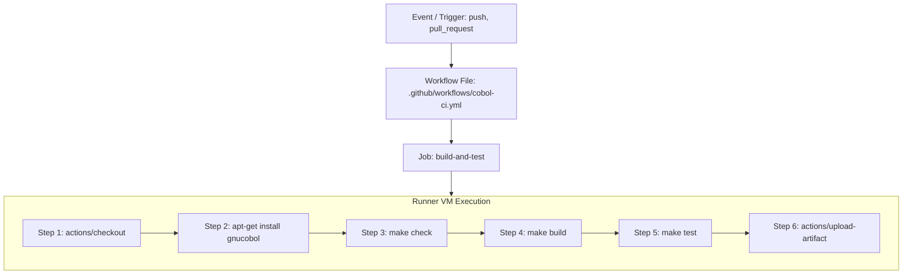

# Chapter 2: GitHub Actions Fundamentals for COBOL

GitHub Actions is a continuous integration and continuous delivery platform that allows you to automate your build, test, and deployment pipeline directly from your GitHub repository.

This chapter explores the core architecture of GitHub Actions, how runners operate, and how to configure a headless Linux runner to compile COBOL code and link external C libraries.

---

## 1. Core Architecture of GitHub Actions

A GitHub Actions automation consists of five fundamental building blocks:



### A. Events (Triggers)
An event is a specific activity that triggers a workflow. Common triggers include:
- `push`: Triggered when code is pushed to specified branches (e.g., `main`, `master`, `release/*`).
- `pull_request`: Triggered when a pull request is opened or updated, validating the branch before merging.
- `workflow_dispatch`: Enables a manual "Run workflow" button in the GitHub web interface for testing on-demand.
- `schedule`: Runs at defined intervals using standard 5-part cron syntax (e.g. nightly batch testing).

### B. Workflows
A workflow is a configurable automated process defined in a YAML file. In active repositories, workflow files must be placed in the `.github/workflows/` directory in the root of your repository. Each workflow contains one or more jobs.

### C. Jobs
A job is a series of steps that execute on the same runner. By default, multiple jobs run concurrently in parallel. If a job depends on another, you can specify `needs: [job_name]` to establish sequential dependency.

### D. Runners
A runner is a server that runs your workflows when triggered. GitHub provides hosted runners (`ubuntu-latest`, `windows-latest`, `macos-latest`), or you can host your own self-hosted runners in your own private cloud or data center.

For compiling modern COBOL with GnuCOBOL, **`ubuntu-latest`** is the standard, high-performance Linux choice.

### E. Steps
Steps are individual tasks that run commands in a job. A step can either be:
- An **Action**: A reusable extension (e.g., `actions/checkout@v4` or `actions/upload-artifact@v4`).
- A **Shell Command**: A shell script executed in bash (e.g., `run: make build`).

---

## 2. Setting Up the GnuCOBOL Toolchain in an Ephemeral Runner

GitHub-hosted `ubuntu-latest` runners come pre-installed with standard development utilities like Git, Python, and GCC, but **do not include GnuCOBOL or SQLite development headers by default**.

Therefore, the first operational step in any COBOL pipeline is provisioning the toolchain using the Ubuntu Advanced Package Tool (`apt`):

```yaml
      - name: Install GnuCOBOL & SQLite3 Toolchain
        run: |
          sudo apt-get update
          sudo apt-get install -y \
            gnucobol \
            libcob4-dev \
            sqlite3 \
            libsqlite3-dev \
            build-essential \
            gcc \
            make
```

### Package Roles in the Pipeline:
- **`gnucobol`**: Provides the `cobc` COBOL compiler executable.
- **`libcob4-dev`**: Provides `libcob.h` headers and dynamic library symlinks for C-interop.
- **`sqlite3`**: The command-line utility used for automated SQL inspection in test scripts.
- **`libsqlite3-dev`**: The C development headers (`sqlite3.h`) and `libsqlite3.so` required by `cob_sqlite.c`.
- **`build-essential`, `gcc`, `make`**: The underlying C compiler and build automation tool that `cobc` invokes to generate ELF binaries.

---

## 3. Toolchain Diagnostics & Sanity Checks

In enterprise CI pipelines, it is best practice to include a diagnostic verification step immediately following dependency installation. This guarantees that compiler versions and environmental paths are logged in the CI telemetry for troubleshooting:

```yaml
      - name: Check Toolchain Versions
        run: |
          echo "=== Diagnostic Toolchain Check ==="
          cobc --version | head -n 2
          gcc --version | head -n 1
          sqlite3 --version
          which cobc gcc make sqlite3
```

Sample output in the GitHub Actions runner log:
```text
=== Diagnostic Toolchain Check ===
cobc (GnuCOBOL) 3.1.2.0
Copyright (C) 2020 Free Software Foundation, Inc.
gcc (Ubuntu 11.4.0-1ubuntu1~22.04) 11.4.0
3.37.2 2022-01-06 13:25:41 872ba256c361cd6323b57baed7c74160f7399513a1e4e742f5b49d3643310b86
/usr/bin/cobc
/usr/bin/gcc
/usr/bin/make
/usr/bin/sqlite3
```

---

## 4. Understanding Workflow File Syntax

Here is the annotated anatomy of the GitHub Actions workflow template:

```yaml
# 1. Workflow Name: Displayed on the GitHub Actions dashboard
name: COBOL & SQLite CI/CD Pipeline

# 2. Trigger Events: When this workflow executes
on:
  push:
    branches: [ main, master ]
  pull_request:
    branches: [ main, master ]
  workflow_dispatch: # Allows manual trigger from GitHub UI

# 3. Jobs Definition
jobs:
  build-and-test:
    name: Build, Lint & Test COBOL Application
    runs-on: ubuntu-latest # Virtual machine environment

    steps:
      # Step 1: Clones your repository into the runner's workspace
      - name: Checkout Repository
        uses: actions/checkout@v4

      # Step 2: Installs compilers and database libraries
      - name: Install GnuCOBOL & SQLite3 Toolchain
        run: |
          sudo apt-get update
          sudo apt-get install -y gnucobol libcob4-dev sqlite3 libsqlite3-dev make

      # Step 3: Fast syntax validation
      - name: Syntax Linting & Check
        run: make -C module_8 check

      # Step 4: Compiles native binary
      - name: Build Native Binary
        run: make -C module_8 build

      # Step 5: Executes test suite & asserts database state
      - name: Run Automated Test Harness
        run: make -C module_8 test

      # Step 6: Archives binary artifact if all tests pass
      - name: Archive Compiled Binary Artifact
        uses: actions/upload-artifact@v4
        if: success()
        with:
          name: inventory-app-linux-x64
          path: module_8/bin/inventory_app
          retention-days: 7
```

---

## 5. Working Directory Isolation: The `-C` Flag

In a monorepo or multi-module repository (such as this training repository), the root contains multiple modules (`module_1`, `module_2`, ..., `module_8`).

To instruct Make and shell commands to operate inside the target module without changing the runner's global working directory, use the **`-C` flag**:
```bash
make -C module_8 build
make -C module_8 test
make -C module_8 clean
```
This guarantees clean paths and prevents files from leaking into the repository root.

---

## 6. Summary & Next Steps

Now that you understand the runner lifecycle and workflow syntax, let's explore how to design effective tests, assert database transactions, and handle COBOL process exit codes in [03. Building & Testing COBOL & SQLite Pipelines](file:///home/wesi/codes/cobol-training/module_8/03_building_and_testing_cobol_sqlite_pipeline.md).

