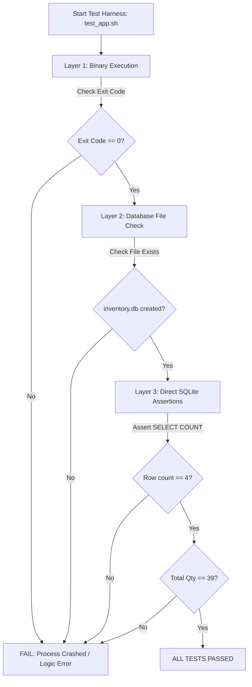

# Chapter 3: Building & Testing COBOL & SQLite Pipelines

A Continuous Integration pipeline is only as reliable as its automated testing and verification steps. If a pipeline only checks whether an application compiles without verifying that business calculations and database transactions execute properly, defective code can easily escape into production.

This chapter details the mechanics of building, linting, and automated testing for GnuCOBOL applications interacting with an embedded SQLite3 relational database.

---

## 1. Fast Feedback: Syntax Linting with `cobc -fsyntax-only`

In software engineering, the **Fail Fast** principle states that problems should be exposed at the earliest possible stage.

Compiling a full binary, linking external C libraries, and assembling object code takes time. If a developer introduces a simple syntax error (e.g., misspelled variable name, missing period, or invalid picture clause), there is no need to invoke the C compiler backend (`gcc`).

GnuCOBOL provides the `-fsyntax-only` flag:
```bash
cobc -fsyntax-only -free -I src src/app.cob
```

- **Execution Time**: ~50 milliseconds.
- **Behavior**: Scans tokens, validates divisions, verifies copybooks, checks picture definitions, and exits with code `0` if valid, or `1` if invalid.
- **In CI/CD**: Run this step before `make build`. If syntax errors exist, the pipeline fails immediately, saving runner minutes.

---

## 2. Compilation and C-Bridge Linkage

Once syntax validation passes, the pipeline compiles the native Linux binary.

```bash
cobc -x -free -I src src/app.cob src/cob_sqlite.c -lsqlite3 -o bin/inventory_app
```

### Breakdown of Compiler Directives:
- **`-x`**: Tells `cobc` to generate a standalone executable program with a `main()` entry point.
- **`-free`**: Enables modern free-format COBOL source (no legacy 80-column punchcard restrictions).
- **`-I src`**: Adds `src/` to the copybook include search path so `COPY "SQLITE.CPY"` resolves cleanly.
- **`src/cob_sqlite.c`**: Informs `cobc` to pass the C-bridge source file to the GNU C compiler (`gcc`).
- **`-lsqlite3`**: Instructs the linker (`ld`) to link against the shared object `libsqlite3.so`.
- **`-o bin/inventory_app`**: Specifies the output path and binary name.

---

## 3. Exit Codes: How CI Runners Detect Failure

GitHub Actions and Linux shells evaluate the success or failure of each step using the **process exit code** (also called return code or status code).

```text
Return Code = 0   ===>   SUCCESS (Green Checkmark)   ===>   Proceed to Next Step
Return Code != 0  ===>   FAILURE (Red X)             ===>   Pipeline Aborted!
```

### Managing Exit Codes in COBOL:
In GnuCOBOL, the special register `RETURN-CODE` communicates the exit status directly to the operating system kernel:

```cobol
       *> Success: Exit with code 0
       MOVE 0 TO RETURN-CODE
       STOP RUN.

       *> Failure: Exit with code 1 (or specific error number)
       DISPLAY "[FATAL ERROR] Database transaction failed!"
       MOVE 1 TO RETURN-CODE
       STOP RUN.
```

When `RETURN-CODE` is non-zero, the bash shell running inside the GitHub Actions runner captures the failure (`$? != 0`) and automatically marks the step as failed, preventing defective builds from advancing.

---

## 4. Multi-Layered Testing Strategy

For database-backed COBOL applications, automated testing must occur across multiple layers:



### Layer 1: Process Execution & Return Code
The test runner launches `./bin/inventory_app`, captures standard output, and checks that the process terminated cleanly with exit code `0`.

### Layer 2: File System Artifact Verification
The test verifies that the database file `inventory.db` was actually created on disk and is non-empty.

### Layer 3: Independent Database Assertion via `sqlite3` CLI
A common mistake in application testing is only trusting what the application reports in its own stdout. 
The application might claim:
`[INFO] 4 inventory records seeded successfully.`
...but a bug in transaction handling (`ROLLBACK` accidentally issued instead of `COMMIT`) could leave the database empty!

To prevent false positives, our automated test script uses the external **`sqlite3` CLI** to query `inventory.db` independently:

```bash
# Query record count independently
ROW_COUNT=$(sqlite3 inventory.db "SELECT COUNT(*) FROM inventory;")

# Query quantity sum independently
TOTAL_QTY=$(sqlite3 inventory.db "SELECT SUM(quantity) FROM inventory;")

# Assert values in Bash
if [ "${ROW_COUNT}" -ne 4 ]; then
    echo "[FAIL] Expected 4 records, found: ${ROW_COUNT}"
    exit 1
fi

if [ "${TOTAL_QTY}" -ne 39 ]; then
    echo "[FAIL] Expected 39 total quantity, found: ${TOTAL_QTY}"
    exit 1
fi
```

If any condition is violated, the test harness exits with code `1`, instantly failing the GitHub Actions workflow.

---

## 5. Summary & Next Steps

By combining syntax linting, native compilation, and independent multi-layer assertions, our pipeline provides 100% test confidence.

In the next chapter, [04. Pipeline Security, Caching & Artifact Release](file:///home/wesi/codes/cobol-training/module_8/04_pipeline_security_caching_and_release.md), we will learn how to package and download compiled binaries using GitHub Action artifacts and optimize pipeline execution speed using cache actions.

